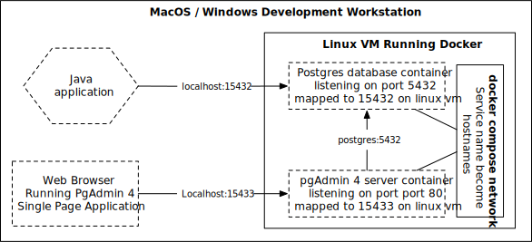
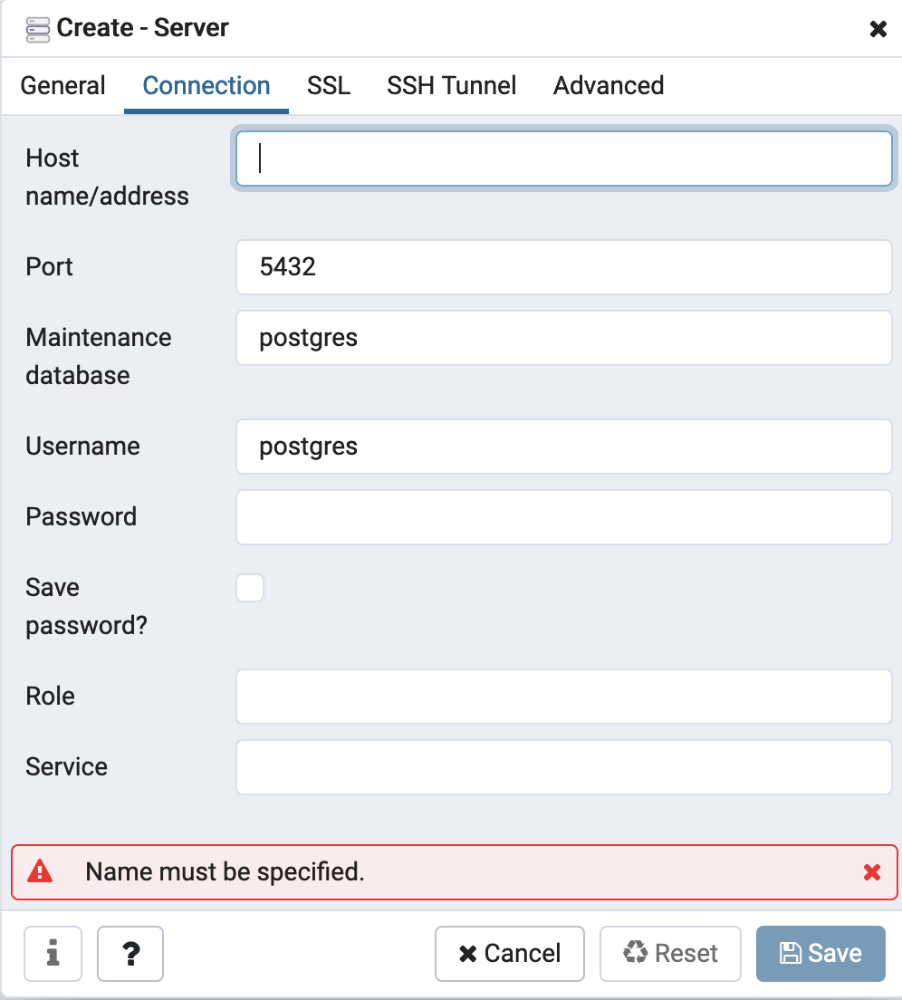

# Developer Friendly Local Postgres with Docker Compose

To run the sample application follow the following steps

* checkout the code 
* run postgres and pgAdmin `docker-compose up`
* Using a browser go to `localhost:15432` and explore the pgAdmin console, there should be two 
databases demo1 and demo2. You should not be challenged for any passwords by pgAdmin. 
* run the spring boot sample application with `./mvnw spring-boot:run` you will need Java 11 JDK
installed for this command to work. If you are only interested in the postgres docker-compose 
configuration you can skip this step.

# Overview 
PostgresSQL is a very powerful open source database that is available everywhere from 
developer laptop to cloud providers. I have been using postgres for decades starting
in 1997, and I am always looking for ways to optimize my dev workstation configuration. 

There are two distinct ways that I use postgres on my dev workstation

* ephemeral mode to execute automated tests
* persistent mode for manual dev and testing 

For automated integration testing I rely on the [test containers](https://www.testcontainers.org/) project 
to automatically launch a fresh postgres database for each junit test. This
makes tests reproducible, relatively quick and painless to write. While these
tests are executing I don't need to interact with the postgres server that 
the test is running against, I leave it all for test containers to manage
the lifecycle of the server.

As I write code that talks to the database I frequently want to inspect
the postgres database to test my code manually via the GUI. 
For many years I got away with installing a local PostgresSQL on 
my dev machine and that was easy simple way for me. However, everytime a new 
developer joined the project I had to walk them through how to set up and 
configure Postgres on their local workstation. Sometimes there would be a need
for two different versions of Postgres to run locally which complicates things.
Also, setup instructions would be different between MacOS, Windows, and Linux
depending on what the developer was using. 

Docker compose can be used to simplify and the developer workstation setup. The
rest of this blog provides you with step by step instructions on how to set up
an optimized developer friendly Postgres with docker-compose.

# Postgres & PgAdmin Containers

The core postgres server includes a cli called `psql` which you can use to 
execute SQL commands against the database. [PgAdmin 4](https://www.pgadmin.org/)
is the graphical interface for working with Postgres. PgAdmin 4 is a single page
web application written in JavaScript that talks to backend written in python. 
The diagram below shows the relationship between the various applications, containers, 
virtual machines running on a typical Docker desktop installed on MacOS or Windows.



On a Linux development workstation there would be no need for a virtual machine
since the docker daemon would run natively on the VM. The mapping of the ports would still
be the same. 

# Development Workflow 

The containers in the above diagrams can be lanuched with 
`docker-compose up` using the demo files in [this](https://github.com/asaikali/docker-compose-postgres) repo. The pgAdmin 4 container is configured with a 
an authenticated connected to the postgres server so that when you visit it's
url at `localhost:15433` you won't have to enter any password, or configure any 
dialog boxes to connect to the database. Setting up the containers wit 
pre-configured connectivity is a bit tricky, the rest of this post shows you
the configuration works. 

# Setting up the docke-compose volumes and network 

The full docker compose file is in the repo at [docker-compose.yml](docker-compose.yml) we will break it down into parts and explain how 
each section works. 

```yaml
version: '3.7'

volumes:
    postgres:
    pgadmin:
```

The above section defines standard docker-compose file version number, and 
it also defines two volumes. The postgres volume will be used by the 
container running postgres, this means that the state of the postgres 
database will survive restarts of the container. Similarly, the pgAdmin 
volume will be used by the pgAdmin backend container to store its configuration
 settings across container restarts.

Docker compose will automatically create a single network that all the 
containers in the docker-compose file will be connected to. docker-compose 
derives the network name from te directory name of the 
`docker-compose.yml` in this example the network will be called `docker-compose-postgres_default` 

# Setting up the PostgresSQL Container

The `docker-compose.yml` contains a service named `postgres` defined below.  

```yml
services:
  postgres:
    container_name: demo_postgres
    image: "postgres:12"
    environment:
      POSTGRES_USER: "postgres"
      POSTGRES_PASSWORD: "password"
      PGDATA: "/data/postgres"
    volumes:
       - postgres:/data/postgres
       - ./docker_postgres_init.sql:/docker-entrypoint-initdb.d/docker_postgres_init.sql
    ports:
      - "15432:5432"
    restart: unless-stopped
```
In order to make the environment reproducible and predictable we explicitly set 
the postgres container version to `postgres:12` which will always give us the most recent
bug fix release of postgres 12.  Setting the container tag to `postgres:latest` or 
`postgres` will lead unpredictability as we will get whatever is the latest version of 
postgres at the time we run the `docker-compose up` command which is probably not 
what we want. 

To configure the administrative user for the database we set the `POSTGRES_USER` and
`POSTGRES_PASSWORD` environment variables. 

Postgres database files are stored in `/data/postgres`. 
This directory is mapped to postgres volume via the mapping `postgres:/data/postgres`.

When the postgres container launches it looks for a file called `docker_postgres_init.sql` 
which will be executed right after startup to configure the database. For example, you can 
create two databases `demo1` and `demo2` using the DDL below. 

```SQL
CREATE DATABASE demo1
    WITH
    OWNER = postgres
    ENCODING = 'UTF8'
    LC_COLLATE = 'en_US.utf8'
    LC_CTYPE = 'en_US.utf8'
    TABLESPACE = pg_default
    CONNECTION LIMIT = -1;

CREATE DATABASE demo2
    WITH
    OWNER = postgres
    ENCODING = 'UTF8'
    LC_COLLATE = 'en_US.utf8'
    LC_CTYPE = 'en_US.utf8'
    TABLESPACE = pg_default
    CONNECTION LIMIT = -1;
```

The postgres container looks for the initialization sql file at the path 
`/docker-entrypoint-initdb.d/docker_postgres_init.sql` therefore to make things 
simple we store our ddl in a file called  `docker_postgres_init.sql` and put it 
at the same level as the `docker-compose.yml` as show by the example directory
listing below. 

```
-rw-r--r--   1 adib  staff   1.0K  2 Aug 20:37 docker-compose.yml
-rw-r--r--   1 adib  staff   300B  2 Aug 17:04 docker_pgadmin_servers.json
-rw-r--r--   1 adib  staff   375B  2 Aug 16:35 docker_postgres_init.sql
```

The init sql file is mapped to the place where the postgres container expects it to
be via the volume mapping below. 

```yaml
 volumes:
       - ./docker_postgres_init.sql:/docker-entrypoint-initdb.d/docker_postgres_init.sql
```

In order to make the postgres database running inside the docker container accessible to 
applications we are coding on the workstation  we map the default postgres port `5432` to
`15432` as shown by the docker-compose configuration below.

```yaml
    ports:
      - "15432:5432"
```

When a developer checks out the git repo with the application source code in it we want 
them to be able to run `docker-compose up` and have that work, this is why we expose 
port `15432` since the workstation might already have postgres installed  natively listening
on the default port `5432`. Our hope is that port `15432` is available on the developer's
workstation. 

For example the spring boot application included in this repo can connect to the postgres
database using the `application.yml` below 

```yaml
spring:
  datasource:
    url: "jdbc:postgresql://127.0.0.1:15432/demo1"
    username: postgres
    password: password
```

Running the application with the command `./mvnw spring-boot:run` and making a request
to `localhost:8080/` should return a random quote similar to the one below 

```json
{
    "author": "Vincent Lombardi",
    "id": 4,
    "quote": "Success demands singleness of purpose"
}
```

The sample application uses [Flyway DB](https://flywaydb.org/) to manage the configuration 
of the database. You can find the DDL it uses in `src/main/resources/db/migration/V1__create_quotes_table.sql` 

# # Setting up the pgAdmin 4 Container

To set up the pgAdmin container we use the following service in the `docker-compose` file

```yaml
  pgadmin:
    container_name: demo_pgadmin
    image: "dpage/pgadmin4:4.24"
    environment:
      PGADMIN_DEFAULT_EMAIL: admin
      PGADMIN_DEFAULT_PASSWORD: admin
      PGADMIN_CONFIG_SERVER_MODE: "False"
      PGADMIN_CONFIG_MASTER_PASSWORD_REQUIRED: "False"
    volumes:
       - pgadmin:/var/lib/pgadmin
       - ./docker_pgadmin_servers.json:/pgadmin4/servers.json
    ports:
      - "15433:80"
    entrypoint:
      - "/bin/sh"
      - "-c"
      - "/bin/echo 'postgres:5432:*:postgres:password' > /tmp/pgpassfile && chmod 600 /tmp/pgpassfile && /entrypoint.sh"
    restart: unless-stopped    
```

In order to have a repeatable build we use a specific version of the pgAdmin
container `dpage/pgadmin4:4.24` David Page the publisher of the container image
is the lead developer and maintainer of pgAdmin so this is a good container 
image to use. 

pgAdmin can run in one of two modes desktop mode or server mode. When running in 
desktop mode pgAdmin assumes that it can only be reached from a developer's workstation
and thus it will not require authentication to access the pgAdmin user interface.
In server mode pgAdmin assumes that is accessible to anyone over the network therefore
it will require users to log in. 

Since we are running pgAdmin in docker compose we want to be able to go to 
`localhost:15432` be taken straight to the UI without having to log in. Therefore,
we run it in desktop mode by setting the environment variable `PGADMIN_CONFIG_SERVER_MODE: "False"`.

Even though we are running pgAdmin in desktop mode we still need to set up an admin username and
password for it we do this bu setting the environment variables 

```yaml
    environment:
      PGADMIN_DEFAULT_EMAIL: admin
      PGADMIN_DEFAULT_PASSWORD: admin
```

pgAdmin is a generic console it can connect to multiple postgres servers. Therefore, it stores 
the details of databases to connect to such as hostname, port number, user name, passwords 
in pgAdmin. Since these credentials are sensitive in encrypts them with a master password 
that must be entered by the user everytime they use pgAdmin. Since we are running pgAdmin 
on the laptop we can disable the master password with the environment 
variable `PGADMIN_CONFIG_MASTER_PASSWORD_REQUIRED: "False"`

Normal behaviour of pgAdmin is for a user to use the GUI to define a connetion to a database as
shown below.



To avoid having to enter the connection settings we can create a file json file with 
all the connection details that pgAdmin will use to connect on startup. 

```json
{
    "Servers": {
      "1": {
        "Name": "Docker Compose",
        "Group": "Servers",
        "Port": 5432,
        "Username": "postgres",
        "Host": "postgres",
        "SSLMode": "prefer",
        "MaintenanceDB": "postgres",
        "PassFile": "/tmp/pgpassfile"
      }
    }
  }
```

The pgAdmin container looks for connections file at `pgadmin4/servers.json` therefore
we store the configuration file at `docker_pgadmin_servers.json` and map it into
the pgAdmin container using the mapping `./docker_pgadmin_servers.json:/pgadmin4/servers.json`

In order for pgAdmin to store it's state across container restarts we map the location 
it stores state `/var/lib/pgadmin` to the docker volume `pgadmin` as shown in the yaml
below. 

```yaml
      volumes:
       - pgadmin:/var/lib/pgadmin
       - ./docker_pgadmin_servers.json:/pgadmin4/servers.json
```

pgAdmin does not provide a way to set passwords for the connections in `servers.json` since
database passwords are sensitive and therefore should not be stored locally. This is a 
very good policy on pgAdmin's part but given our goal of being able to just land directly
in the UI on the database we have to override the pgAdmin container entry point with 
a shell script of our own you can see the details below. 

```yaml
  entrypoint:
      - "/bin/sh"
      - "-c"
      - "/bin/echo 'postgres:5432:*:postgres:password' > /tmp/pgpassfile && chmod 600 /tmp/pgpassfile && /entrypoint.sh"
```

Docker executes an entry point via exec() function call without any shell expansion. 
A docker entry point is defined as an array of strings the first is the name of the executable 
to run followed by the parameters to pass to the executable. To make formatting easier in  the 
`docker-compose` file I used the list form as show in the snippet directly above. 
If we remove the yaml and docker entry point formatting the bash executed is the one below.

 ```bash
 /bin/sh -c /bin/echo 'postgres:5432:*:postgres:password' > /tmp/pgpassfile && chmod 600 /tmp/pgpassfile && /entrypoint.sh
 ```

`/bin/sh -c` is used to execute the shell with input from the command line rather than from a file. 
The `&&` is used to chain a series of separate commands on a single line. If any command fails
subsequent commands will not be executed. With these advanced shell features explained we can 
breakdown the command into simpler steps. 

```bash
/bin/echo 'postgres:5432:*:postgres:password' > /tmp/pgpassfile 
```

The command above will write a postgres password file to `/tmp/pgpassfile` which is referenced
in the `servers.json` 

```json
{
    "Servers": {
      "1": {
        "PassFile": "/tmp/pgpassfile"
      }
    }
  }
```

A postgres password file has the format `hostname:port:database:username:password` with 
the ability to use `*` a wild card match on the first 4 fields. So we write 
`postgres:5432:*:postgres:password` into the `/tmp/pgpassfile` notice that we use 
`*` for the database portion this means that for all databases pgAdmin will try to use
`postgres` as the username and `password` as the password.

For security reasons pgAdmin will ignore any password files that are not locked down with 
unix permissions of 600. Therefore, the next command we execute is `chmod 600 /tmp/pgpassfile`

With the password file written and with the correct unix permission we lanuch pgAdmin container
entry point by calling `/entrypoint.sh` which on startup will find password file and server
connections that point to the postgres we launched in docker. The net result is that you can 
just click around the pgAdmin UI, and you will not have to set up any connections or passwords.

# Conclusion 

Using `docker-compose up` to launch a postgres and pgAdmin can simplify local development
environment configuration. Configuring pgAdmin so that it does not ask for passwords, 
and connection information requires some tricky shell scripting that was broken down
and explained step by step in this post. Checkout the git repo with the `docker-compose` 
configuration and sample app from 
[https://github.com/asaikali/docker-compose-postgres](https://github.com/asaikali/docker-compose-postgres).


