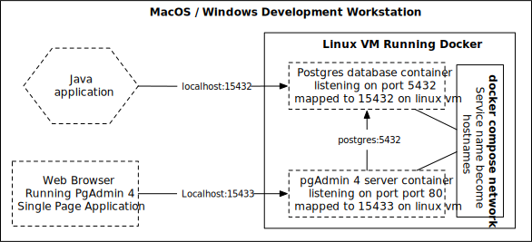
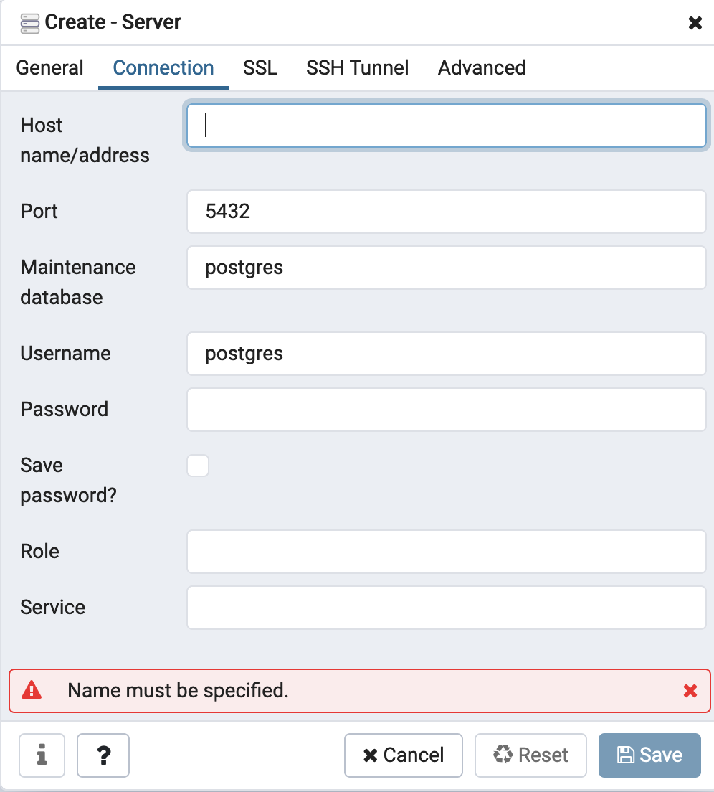

# Frictionless Local Postgres with Docker Compose

Steps to try out the sample.

* checkout the code 
* run postgres and pgAdmin using `docker compose up`
* Using a browser go to `localhost:15433` and explore the pgAdmin console. There should be two
databases `demo1` and `demo2`. pgAdmin will not ask for any passwords.
* run the spring boot sample application with `./mvnw spring-boot:run` you will need Java 25 JDK
installed for this command to work. If you are only interested in the postgres docker-compose
configuration you can skip this step.

Check out my blog [adibsaikali.com](https://adibsaikali.com) for a nice directory of other samples
and technical posts. Full details of how the sample works below. 

# Overview 
PostgresSQL is a very powerful open source database that is available everywhere from 
laptops to cloud providers. I have been using postgres for decades starting
in 1998. There are two distinct ways that I use postgres on my dev workstation.

* ephemeral mode to execute automated tests
* persistent mode during development and manual testing 

For automated integration testing I rely on the [test containers](https://www.testcontainers.org/) 
project to automatically launch a fresh postgres database for each junit test. This makes tests 
reproducible, relatively quick and painless to write. While tests are executing I don't need to 
interact with the postgres server the tests are running against.

As I write code and manually interact with the application I am working on I want inspect the 
postgres database the application is talking to. For many years I got away with installing a 
local PostgresSQL on my dev machine. Everytime a new developer joins the project they have to 
install PostgreSQL on their workstation, then run a script to create the development database. 
If the developer is working on two different applications that use different versions of PostgreSQL
then local workstation setup gets more complicated. Docker compose can significantly reduce local
development environment setup friction. 

Setting up pgAdmin with pre-configured connectivity and passwords is tricky, it requires 
in depth understanding of containers, docker, docker-compose, shell scripting, and how pgAdmin 
works. This repo provides a frictionless docker-compose pgAdmin and postgres configuration.

# Postgres & PgAdmin Containers

[PgAdmin 4](https://www.pgadmin.org/) is the graphical interface for working with Postgres, it is
a single page JavaScript web application with a python backend.  The diagram below shows the 
relationship between the various applications, containers, virtual machines running on a typical 
Docker desktop installed on MacOS or Windows.



On a Linux  workstation there is no need for a virtual machine since the docker daemon can run 
natively. The port numbers on the diagram are the same for docker on linux. Setting up the 
containers with pre-configured connectivity is a bit tricky. Read on for the gory details.

# Setting up the docker-compose volumes, configs, and network

We will break down the [docker-compose.yml](docker-compose.yml)  into parts and explain how
each part works.

```yaml
volumes:
    postgres:
    pgadmin:
```

The above section defines
two volumes. The postgres volume will be used by the container running postgres, this means
that the state of the postgres database will survive restarts of the container. Similarly,
the `pgadmin` volume will be used by the pgAdmin container to store its configuration
settings across container restarts.

## Inline Config Files

Docker Compose v2.23.1+ supports inline config files using the top-level `configs` section
with a `content` field. This lets you define small configuration files directly inside
`docker-compose.yml` instead of maintaining separate files on disk. Compose mounts the
content as a read-only file inside the container at the path specified by `target`.

```yaml
configs:
  postgres_init:
    content: |
      CREATE DATABASE demo2;
  pgadmin_servers:
    content: |
      {
        "Servers": {
          "1": {
            "Name": "Docker Compose",
            "Group": "Servers",
            "Port": 5432,
            "Username": "postgres",
            "Host": "postgres",
            "SSLMode": "prefer",
            "MaintenanceDB": "postgres",
            "PassFile": "/tmp/pgpassfile"
          }
        }
      }
```

The `postgres_init` config contains the SQL script that creates the `demo2` database.
The `pgadmin_servers` config contains the pgAdmin server connection definition. Both are
mounted into their respective containers using the `configs` section on each service.

## Network

Docker compose will automatically create a single network that all the containers will be connected
to and register them in DNS using the docker compose service name. This means that the pgAdmin
container can find the postgres server using its docker-compose service name which is `postgres`.
Docker compose derives the network name from the directory name containing the
`docker-compose.yml` file. In this example the network name is `docker-compose-postgres_default`.

# Setting up the PostgresSQL Container

The `docker-compose.yml` contains a service named `postgres` defined below.

```yml
services:
  postgres:
    container_name: demo_postgres
    image: "postgres:18"
    environment:
      POSTGRES_USER: "postgres"
      POSTGRES_PASSWORD: "password"
      POSTGRES_DB: "demo1"
      PGDATA: "/data/postgres"
    configs:
      - source: postgres_init
        target: /docker-entrypoint-initdb.d/docker_postgres_init.sql
    volumes:
      - postgres:/data/postgres
    ports:
      - "${PG_PORT:-15432}:5432"
    restart: unless-stopped
```
In order to make the environment reproducible and predictable we explicitly set
the postgres container version to `postgres:18` which will always give us the most recent
bug fix release of postgres 18. Setting the container tag to `postgres:latest` or
`postgres` will lead to unpredictability since we will get whatever is the latest version of
postgres at the time we run `docker compose up`.

To configure the administrative user for the database we set the `POSTGRES_USER` and
`POSTGRES_PASSWORD` environment variables.

Postgres database files are stored in `/data/postgres`.
This directory is mapped to postgres volume via the mapping `postgres:/data/postgres`.

## Creating Databases

The postgres Docker image provides two ways to create databases on first startup. This
repo demonstrates both approaches.

### Using the `POSTGRES_DB` Environment Variable

The simplest way to create a database is to set the `POSTGRES_DB` environment variable.
The postgres container will automatically create a database with this name on first startup.
In this repo we use it to create the `demo1` database which is the primary database used
by the Spring Boot application.

```yaml
environment:
  POSTGRES_DB: "demo1"
```

### Using Initialization Scripts

For additional databases beyond the one created by `POSTGRES_DB`, the postgres container
will execute any `*.sql`, `*.sql.gz`, or `*.sh` scripts found in
`/docker-entrypoint-initdb.d/` during first startup.

In this repo we use the `postgres_init` inline config to create a second database called
`demo2`. The config is mounted into the container at the path where postgres looks for
init scripts:

```yaml
configs:
  - source: postgres_init
    target: /docker-entrypoint-initdb.d/docker_postgres_init.sql
```

**Note:** Initialization scripts are only run when the container starts with an empty data
directory. If you need to re-run them, remove the postgres volume first with `./pg clean`.

## Port Mapping

In order to make the postgres database running inside the docker container accessible to
applications on the workstation we map the default postgres port `5432` to
`15432` as shown by the docker-compose configuration below.

```yaml
ports:
  - "${PG_PORT:-15432}:5432"
```

When a developer checks out the git repo with the application source code in it we want
them to be able to run `docker compose up` and have that work, this is why we expose
port `15432` since the workstation might already have postgres installed and listening
on the default port `5432`. Our hope is that port `15432` is available on the developer's
workstation. The port can be customized using the `PG_PORT` environment variable. 

For example the spring boot application included in this repo can connect to the postgres
database using the `application.yml` configuration below 

```yaml
spring:
  datasource:
    url: "jdbc:postgresql://127.0.0.1:15432/demo1"
    username: postgres
    password: password
```

Running the application with the command `./mvnw spring-boot:run` and making a request
to `localhost:8080/` should return a random quote similar to the one below 

```json
{
    "author": "Vincent Lombardi",
    "id": 4,
    "quote": "Success demands singleness of purpose"
}
```

The sample application uses [Flyway DB](https://flywaydb.org/) to manage the configuration 
of the database. You can find the DDL in the file 
`src/main/resources/db/migration/V1__create_quotes_table.sql`.

# Setting up the pgAdmin 4 Container

To set up the pgAdmin container we use the following service in the `docker-compose` file

```yaml
pgadmin:
  container_name: demo_pgadmin
  labels:
    org.springframework.boot.ignore: true
  image: "dpage/pgadmin4:9.13"
  environment:
    PGADMIN_DEFAULT_EMAIL: "admin@example.com"
    PGADMIN_DEFAULT_PASSWORD: "admin"
    PGADMIN_CONFIG_SERVER_MODE: "False"
    PGADMIN_CONFIG_MASTER_PASSWORD_REQUIRED: "False"
    PGADMIN_REPLACE_SERVERS_ON_STARTUP: "True"
  configs:
    - source: pgadmin_servers
      target: /pgadmin4/servers.json
  volumes:
    - pgadmin:/var/lib/pgadmin
  ports:
    - "${PGADMIN_PORT:-15433}:80"
  entrypoint:
    - "/bin/sh"
    - "-c"
    - "/bin/echo 'postgres:5432:*:postgres:password' > /tmp/pgpassfile && chmod 600 /tmp/pgpassfile && /entrypoint.sh"
  restart: unless-stopped
```

In order to have a repeatable build we use a specific version of the pgAdmin container
`dpage/pgadmin4:9.13`. David Page is the lead developer and maintainer of pgAdmin so
`dpage/pgadmin4` is a good container image to use. 

pgAdmin can run in one of two modes desktop mode or server mode. When running in 
desktop mode pgAdmin assumes that it can only be reached from a developer's workstation
and thus it will not require authentication to access the pgAdmin user interface.
In server mode pgAdmin assumes that it is accessible to anyone on the network therefore
it will require users to log in. 

Since we are running pgAdmin on developer workstation accessible only on localhost we want to
skip pgAdmin authentication. Therefore, we run pgAdmin in desktop mode by setting the 
environment variable `PGADMIN_CONFIG_SERVER_MODE: "False"`.

Even though pgAdmin is running in desktop mode we still need to set up an admin 
username and password using the environment variables below. 

```yaml
environment:
  PGADMIN_DEFAULT_EMAIL: "admin@example.com"
  PGADMIN_DEFAULT_PASSWORD: "admin"
```

pgAdmin is a generic console it can connect to multiple postgres servers. Therefore, it stores 
the details of databases to connect to such as hostname, port number, user name, passwords 
in pgAdmin. Since these credentials are sensitive it encrypts them with a master password 
that must be entered by the user everytime they use pgAdmin. Since we are running pgAdmin to 
administer the single local development server running in docker we can disable the master password
with the environment variable `PGADMIN_CONFIG_MASTER_PASSWORD_REQUIRED: "False"`.

Normal behaviour of pgAdmin is for a user to use the GUI to define a connetion to a database as
shown below.



To avoid having to enter the connection settings we define the connection details using an
inline config in `docker-compose.yml` that pgAdmin will import into its configuration.
Setting `PGADMIN_REPLACE_SERVERS_ON_STARTUP: "True"` ensures the server definitions are
reloaded on every container restart, not just the first launch.

```json
{
    "Servers": {
      "1": {
        "Name": "Docker Compose",
        "Group": "Servers",
        "Port": 5432,
        "Username": "postgres",
        "Host": "postgres",
        "SSLMode": "prefer",
        "MaintenanceDB": "postgres",
        "PassFile": "/tmp/pgpassfile"
      }
    }
  }
```

The pgAdmin container looks for connections file at `/pgadmin4/servers.json`. We use the
`pgadmin_servers` inline config to mount it there:

```yaml
configs:
  - source: pgadmin_servers
    target: /pgadmin4/servers.json
```

In order for pgAdmin to store its state across container restarts we map the location
it stores state `/var/lib/pgadmin` to the docker volume `pgadmin` as shown in the yaml
below.

```yaml
volumes:
 - pgadmin:/var/lib/pgadmin
```

pgAdmin provides no mechanism to set passwords for the connections in `servers.json` since
database passwords are sensitive and therefore should not be stored locally. This is a 
very good policy on pgAdmin's part but given our goal of being able to just land directly
in the UI  we have to override the pgAdmin container entrypoint as shown below.

```yaml
entrypoint:
  - "/bin/sh"
  - "-c"
  - "/bin/echo 'postgres:5432:*:postgres:password' > /tmp/pgpassfile && chmod 600 /tmp/pgpassfile && /entrypoint.sh"
```

Docker executes an entrypoint via exec() function call without any shell expansion. 
A docker entry point is an array of strings the first is the name of the executable 
to run followed by the parameters to pass to the executable. To make formatting easier in  the 
`docker-compose` file I used the list form as show in the code snippet above. 
If we remove the yaml and docker entrypoint formatting the command executed is the one below.

 ```bash
/bin/sh -c /bin/echo 'postgres:5432:*:postgres:password' > /tmp/pgpassfile && chmod 600 /tmp/pgpassfile && /entrypoint.sh
```

`/bin/sh -c` is used to execute the shell with input from the command line rather than from a file. 
The `&&` is used to chain a series of separate commands on a single line. If any command fails
subsequent commands will not be executed. With these advanced shell features explained we can 
breakdown the command into individual steps. 

```bash
/bin/echo 'postgres:5432:*:postgres:password' > /tmp/pgpassfile 
```

The command above will write a postgres password file to `/tmp/pgpassfile` which is referenced
in the `servers.json` 

```json
{
    "Servers": {
      "1": {
        "PassFile": "/tmp/pgpassfile"
      }
    }
  }
```

A postgres password file has the format `hostname:port:database:username:password` with 
the ability to use `*` a wild card match on the first 4 fields. So we write 
`postgres:5432:*:postgres:password` into the `/tmp/pgpassfile` notice that we use 
`*` for the database portion this means that for all databases pgAdmin will try to use
`postgres` as the username and `password` as the password.

For security reasons pgAdmin will ignore any password files that are not locked down with 
unix permissions of 600. Therefore, the next command we execute is `chmod 600 /tmp/pgpassfile`

With the password file written with the correct unix permission we launch the pgAdmin container
entry point by calling `/entrypoint.sh` which on startup will find password file and server
connections that point to the postgres we launched in docker. The net result is that you can 
just click around the pgAdmin UI, and you will not have to set up any connections or passwords.

# Test Containers

The sample application in this repo includes the automated test shown below.

```java
@SpringBootTest
class DemoApplicationTests {

	@Autowired
	private QuoteRepository quoteRepository;

	@Test
	@DisplayName("Database has 5 quotes")
	void databaseHas5Quotes() {
		Assertions.assertThat(this.quoteRepository.findAll()).hasSize(5);
	}
}
```

the `src/test/resources/application.yml` config file uses test containers url shown below 

```yaml
spring:
  datasource:
    url: "jdbc:tc:postgresql:15:///demo1?TC_TMPFS=/testtmpfs:rw"
    username: postgres
    password: password
```

Test containers has nice integration with Spring Boot and it uses the specially formatted jdbc
url `jdbc:tc:postgresql:15:///demo1?TC_TMPFS=/testtmpfs:rw` to launch a postgres container,
create a database called demo1 and put the postgres data directory on a temporary in RAM
file system for optimal performance of Postgres while the test is executing. The postgres database
will only exist for the duration of the test case execution there is no point in storing its data
on disk. 

# Conclusion 

Using `docker-compose up` to launch a postgres and pgAdmin can simplify local development
environment configuration. Configuring pgAdmin so that it does not ask for passwords, 
and connection information requires some tricky shell scripting that was broken down
and explained step by step in this repo.

# Using the pg Script

This repository includes a convenient shell script called `pg` that simplifies the management of PostgreSQL and pgAdmin containers. The script provides a simple command-line interface to start, stop, and manage the Docker Compose setup.

## Commands

- `./pg start`: Start PostgreSQL and pgAdmin containers in detached mode
- `./pg status`: Display container status and connection information (including JDBC URL and psql command)
- `./pg stop`: Stop the running containers
- `./pg clean`: Stop containers and remove all associated volumes (data cleanup)
- `./pg fix`: Detect and resolve port conflicts automatically

## Examples

Start the containers:
```bash
./pg start
```

Check the status and get connection information:
```bash
./pg status
```

Stop the containers:
```bash
./pg stop
```

If you encounter port conflicts (e.g., ports 15432 or 15433 are already in use), you can use:
```bash
./pg fix
```

The script will automatically detect containers using these ports and stop them.

## Environment Variables

You can customize the ports used by setting environment variables before running the script:
- `PG_PORT`: PostgreSQL port (default: 15432)
- `PGADMIN_PORT`: pgAdmin port (default: 15433)

Example:
```bash
PG_PORT=25434 PGADMIN_PORT=25435 ./pg start
```
```bash
PG_PORT=25434 PGADMIN_PORT=25435 ./pg status
```

```bash
PG_PORT=25434 PGADMIN_PORT=25435 ./pg stop
```
